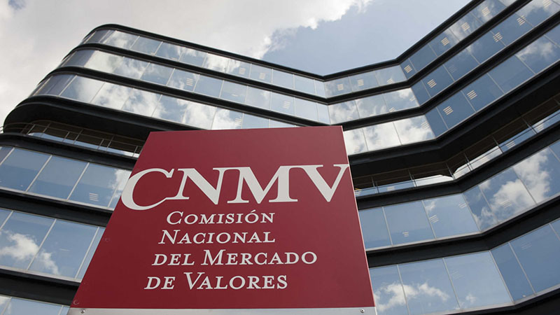

# Criptomonedas y 33 proyectos blockchain asesorados por CNMV

[https://www.blockchaineconomia.es/criptomonedas-blockchain-cnmv/](https://www.blockchaineconomia.es/criptomonedas-blockchain-cnmv/)

El portal de innovación Fintech de la CNMV (Comisión Nacional del Mercado de Valores) **ha recibido más de 33 consultas sobre proyectos empresariales de blockchain, de inversión en criptomonedas y de ICOS (lanzamientos de nuevas criptomonedas)**. “Hemos recibido unas 200 consultas en el portal, y crecen las referidas a las criptomonedas y los ICOS, en los últimos meses”, explicó Víctor Rodríguez Quejido, director general de Política Estratégica y Asuntos Internacionales de la CNMV, en el reciente congreso Revolution Banking, celebrado en Madrid.

Los expertos de la CNMV **aconsejan sobre el encaje de los proyectos tecnológicos relativos al mercado de valores, con la normativa española,** mientras las autoridades europeas realizan una regulación específica a los modelos de negocio traídos por nuevas tecnologías, como es el caso del blockchain. [El supervisor español ha decidido alinearse con las autoridades europeas](https://blockchaineconomia.es/espana-regular-criptomonedas/), y trabaja con ellas para definir el mercado de las criptomonedas. Mientras tanto, ha creado el [portal Fintech,](https://www.cnmv.es/portal/Fintech/Innovacion.aspx) siguiendo los consejos de las autoridades europeas de fomentar la innovación y la protección al inversor.

De igual forma, **la CNMV trabaja para crear un Sandbox regulatorio**. Será un banco de pruebas para facilitar la normativa a nuevos modelos de negocio creados con la tecnología, **donde los desarrolladores harán pruebas reales con clientes voluntarios, durante seis meses a un año.**

“La idea es instaurar un Sandbox entre la CNMV, el Banco de España y la Dirección General de Seguros. El emprendedor trabajaría en el banco de pruebas para que el regulador pudiera ver el funcionamiento, los problemas que puedan surgir con el consumidor, y tener ese aprendizaje ganado en el momento de regularlo. **Sería una forma de adelantar las regulaciones**”, añadió Víctor Rodríguez Quejido.

**Los proyectos DLT (proyectos basados en tecnología blockchain) y criptomonedas son los segundos en volumen de preguntas realizadas a la CNMV**, más de 33, junto con el apartado de ICOS. Superan esta cifra las 61 preguntas hechas por las empresas con proyectos de plataformas de financiación participativa (PFP), el conocido como crowdfunding, que lleva muchos más años en el mercado. La CNMV trabaja activamente por la [tecnología blockchain.](https://www.blockchaineconomia.es/la-bolsa-espanola-entra-en-blockchain-con-alastria-y-cnmv/)

[Previous Post](https://www.blockchaineconomia.es/cnmv-regular-criptomonedas/)

