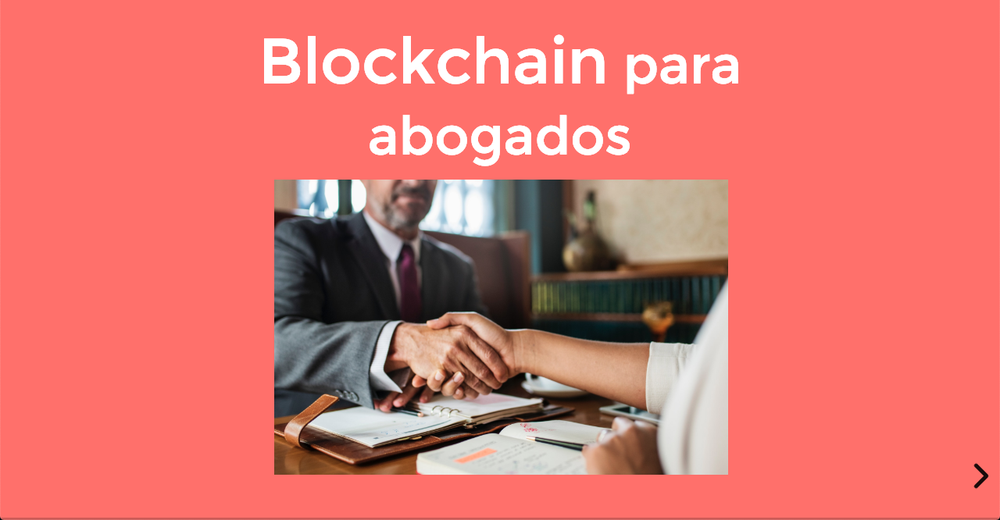

# Blockchain: aspectos jurídicos

{:target="\_blank"}
Slides &#9757;

# Descripción

En la actualidad podríamos decir que no hay aspecto de nuestras vidas que no sea impactado por las nuevas tecnologías y la digitalización. Uno de las tecnologías que más impacto está causando ya es la cadena de bloques o _blockchain_ que está generando la transición de la internet de la información a la internet del valor.

Este taller está dirigido a abogados, licenciados en derecho, estudiantes, que quieran familiarizarse con las implicaciones jurídicas de blockchain y estar en capacidad de asesorar a sus clientes.

# Contenido

- La internet del valor: haremos un repaso a la historia del blockchain y los principales casos en los que actualmente se está utilizando. (Finanzas, Seguros, Educación, Música, Crowdfunding, Periodismo, Trazabilidad, Auditoría Ciudadana, entre otros)
- En 2018 vivimos el escándalo del uso de los datos de millones de usuarios de Facebook sin su autorización por parte de Cambridge Analytica, la entrada en vigor del Reglamento General de Protección de Datos (GPDR) y la primera gran multa de 400.000€ por incumplimiento de este reglamento. La gestión de datos personales está cada día más en la agenda de empresas y ciudadanos Con blockchain viviremos un cambio radical hacia la identidad soberana para recuperar el control de nuestros datos.
- ¿Eliminará blockchain de la necesidad de los abogados? Debatiremos cómo esta nueva tecnología afectará el día a día de los despachos en materia de Derecho de Familia, Herencias y testamentos, Derecho Inmobiliario, Derecho bancario, Responsabilidad, seguros y accidentes, Derecho laboral y Seguridad Social, Pequeñas y Mediana Empresa

El formato será de dos sesiones informativas y una sesión de preguntas y respuestas para que puedas aclarar todas las dudas que tienen que ver con tu actividad profesional.

Si quieres conocer la respuesta a todas estas preguntas, acompáñanos en este evento y únete a nuestra comunidad de entusiastas de la tecnología Imaguru Startup Hub

---

# Primer Día

El objetivo del primer día es presentar al estudiante la definición de la internet del valor y sus principales aplicaciones en el mundo actual, tomando como referencia las aplicaciones ya existentes de la internet de la información

- Internet del valor
- Criptoactivos
- Identidad soberana
- Smart Contracts
- Finanzas
- Seguros
- Educación
- Música
- Crowdfunding
- Periodismo
- Trazabilidad
- Auditoría Ciudadana

# Segundo Día

El objetivo de este día es analizar cómo se han adaptado las principales instituciones jurídicas de derecho privado a la evolución de las nuevas tecnologías, concretamente a internet, para intentar predecir tendencias y aplicaciones a medida que blockchain se va adoptando por la sociedad. Por cada institución se propone una prueba de concepto para el análisis, evaluación y debate de los estudiantes.

## Smart Contracts

Definición de **Nick Szabo** - Diferencias entre Web Code / Dry Code

[Wet code and dry](https://unenumerated.blogspot.com/2006/11/wet-code-and-dry.html){:target="\_blank"}

Implicaciones:

**Warranties and representations**

[Qué son las Representations & Warranties - Traducción Jurídica](https://traduccionjuridica.es/las-representations-warranties/){:target="\_blank"}

**Incumplimiento de contrato**

[¿Cómo procede un incumplimiento de contrato? Navas & Cusí](https://www.navascusi.com/como-procede-un-incumplimiento-de-contrato/){:target="\_blank"}

## Initial Coin Offering (ICO)

Prueba de concepto: ICO como mecanismo de financiación con token de activo subyacente o Security Token

[Criterios en relación con las ICO - 20 de septiembre de 2018](CriteriosICOs-c3698b45-75a3-4f3b-8a5d-573f2be0dc52.pdf){:target="\_blank"}

[Consideraciones de la CNMV sobre 'criptomonedas' e 'ICOs' dirigidas
a los profesionales del sector financiero - 8 de febrero de 2018](comunicadoCNMV_ICO_ES_final-d720615f-b6fa-4d16-aa6a-eeb3ece014b3.pdf){:target="\_blank"}

## Derecho de familia

Prueba de concepto: registro de nacimiento en blockchain

[1 de cada 3 niños menores de cinco años no existe porque no se ha registrado su nacimiento](https://www.unicef.es/noticia/registro-de-nacimiento-1-de-cada-3-ninos-no-existe-oficialmente){:target="\_blank"}

## Herencia y Testamentos

Prueba de concepto: Testamento ológrafo abierto vía smart contract

[Regulación del testamento ológrafo abierto](http://noticias.juridicas.com/base_datos/Privado/cc.l3t3.html#t3c1){:target="\_blank"}

## Derecho Inmobiliario

Prueba de concepto: Registro de la Propiedad en blockchain

["Los registradores de la propiedad no tememos la tecnología blockchain"](https://www.blockchaineconomia.es/registradores-de-la-propiedad-blockchain/){:target="\_blank"}

## Derecho Bancario

Prueba de concepto: Proceso de debida diligencia (alta del cliente) asistido por identidad digital soberana (Alastria ID)

[Presentación Alastria Identidad](Alastria-Identidad-a3d17ec1-1495-441e-bd3d-3ce1982f1d28.pdf){:target="\_blank"}

## Responsabilidad Civil, seguros y accidentes

Prueba de concepto: seguro P2P entre cooperativa de seguros y tomador persona física

Ley 20/2015, de 14 de julio, de ordenación, supervisión y solvencia de las entidades aseguradoras y reaseguradoras

Artículo 42 Cooperativas de seguros

[Ley 20/2015, de 14 de julio, de ordenación, supervisión y solvencia de las entidades aseguradoras y reaseguradoras](http://noticias.juridicas.com/base_datos/Fiscal/556605-l-20-2015-de-14-de-julio-de-ordenacion-supervision-y-solvencia-de-las-entidades.html#t2c1s3){:target="\_blank"}

[Blockchain en el sector asegurador](https://www.inese.es/formacion/blockchain-en-el-sector-asegurador-1){:target="\_blank"}

## Derecho Laboral y Seguridad Social

Prueba de concepto: blockchain para la "Gig Economy" ("Uberización")

[España, a la cabeza de Europa en trabajadores de plataformas digitales](https://www.elboletin.com/noticia/165089/tecnologia/espana-a-la-cabeza-de-europa-en-trabajadores-de-plataformas-digitales.html){:target="\_blank"}

## PYME

Prueba de concepto: Decentralized Autonomous Organizations (DAO's)

[Aragon](https://aragon.org/){:target="\_blank"}

# Recursos

## LegalTech

[Clerky | The easiest way for startups to get legal paperwork done safely.](https://www.clerky.com/){:target="\_blank"}

[2019 Global Legal Hackathon](https://globallegalhackathon.com/){:target="\_blank"}

[Primeras sanciones en aplicación del RGPD en Portugal](https://www.garrigues.com/es_ES/garrigues-digital/primeras-sanciones-en-aplicacion-del-rgpd-en-portugal){:target="\_blank"}

[Flixxo - Community based video distribution.](https://flixxo.com/#/){:target="\_blank"}

[Pensiones: El Pacto de Toledo abre la puerta a que los robots financien las pensiones](./Pensiones-El-Pacto-de-Toledo-abre-la-puerta-a-que--607c7377-bef0-42db-8231-746b5791e83e.md){:target="\_blank"}

[Criptomonedas y 33 proyectos blockchain asesorados por CNMV](./Criptomonedas-y-33-proyectos-blockchain-asesorados-8379149d-6a1e-43f0-a09e-acd8d83e7e0d.md){:target="\_blank"}

[The Untold Story of Silk Road, Part 1 | WIRED](./The-Untold-Story-of-Silk-Road-Part-1-WIRED-4bc62011-3449-44cd-933a-a8310b189935.md)

[The Untold Story of Silk Road, Part 2: The Fall | WIRED](./The-Untold-Story-of-Silk-Road-Part-2-The-Fall-WIRE-2bc56d15-e351-4a3f-9186-06d9ba6be4e0.md){:target="\_blank"}

[A Securities Law Framework for Blockchain Tokens - Under US Federal Securities Law](https://docs.google.com/spreadsheets/d/1_XlGPsAywzoxpQmrEJuKYQhp2nr1u0ySCe426qkZmog/edit?usp=sharing){:target="\_blank"}
